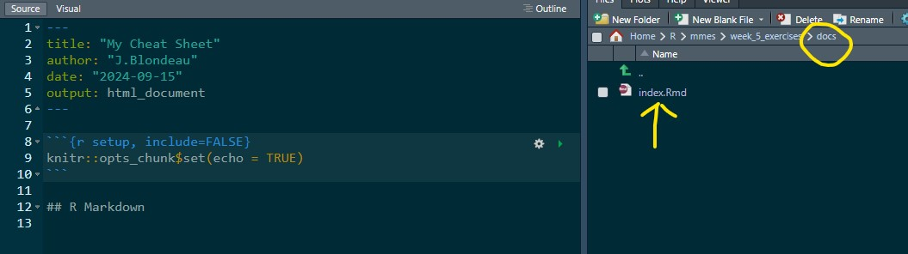

```{r setup, include=FALSE}
knitr::opts_chunk$set(echo = TRUE)
```

# [Header for all above Tabs]{.underline} {.tabset}

<!--# This is a 'comment', anything written here will not appear in the knit -->

## Tab #1: Library, Data, Text Formatting

### Loading Library(s)

```{r}
library(tidyverse)
```

### Reading in data

```{r echo=FALSE}
tmp <- read_csv("../data/PSU_Fish_Density.csv")
#Have to use the ".." to go back a folder because right now we're in docs
```

### Text Formatting

#### **Bold!**

#### *Italics*

#### [Underline]{.underline}

`` adding an additional "`" does this ``

## Tab 2: Ordered and Numbered Lists, Code Chunk Options

-   Insert bulleted list on visual mode

-   Here are some of the code chunk options and their explanations

    -   `include=FALSE`
        -   prevents code and results from appearing in knitted file

        -   RMarkdown still runs code and results can be used in other chunks
    -   `echo = FALSE`
        -   prevents code, but not results from appearing in finished file

        -   useful way to embed figures
    -   `message = FALSE`
        -   prevents messages generated by code from appearing in finished file

        -   things like, "joining by ="variable 1"\`
    -   `warning = FALSE`
        -   prevents warnings generated by code from appearing in finished file
    -   `fig.cap = "…"`
        -   adds a caption to graphical results

## Tab 3: Inserting Images/figure captions

Did this just in visual mode, insert "photo." Don't think it'll work on github because photo is in my desktop


If I want to publish this, maybe just pull a photo from the project folder. Here's one JB already had



## Tab 4: Inserting Tables & Hyperlinks

Insert table on visual mode:

| Fill in names | Part 2 | Part 3 |
|---------------|--------|--------|
|               |        |        |
|               |        |        |
|               |        |        |

: Fill me in!

## Tab 5: Inserting Formulas with LaTeX, Using Citations

1.  Need to add "bibliography: references.bib" to the YAML (can be named anything, but has to be .bib

2.  Then go into docs and add a new blank .txt file

3.  Call it whatever you referenced it as earlier

4.  In visual mode, insert citation, use DOI is easiest

    manuscript reference [@viehman2023]

5.  Will automatically put this citation at teh very bottom

For the LaTex, put in visual mode, and do insert formulas

$4/5 * x^1$
